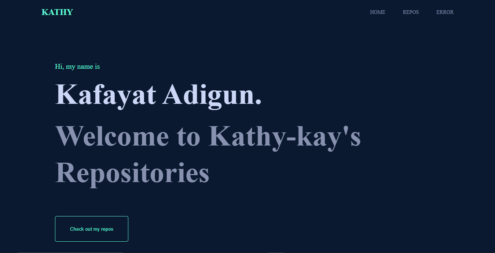

##Altschool of engineering third semester examination

#### Hosted Link
[Live Site](vue-exams-project-roj2he7r4-kathy-kay.vercel.app)

## Git-repos-project
Create a new vue js application then using the GitHub API, fetch your GitHub repositories using this endpoint https://api.github.com/users/{{USERNAME}}/repos. show a page with a list of all your repositories on GitHub(the page should have some form of pagination). Then create another page showing data for a single repo clicked from the list of repos using nested routes. Make sure to implement a wildcard route to catch 404 pages



This template should help get you started developing with Vue 3 in Vite.

## Recommended IDE Setup

[VSCode](https://code.visualstudio.com/) + [Volar](https://marketplace.visualstudio.com/items?itemName=Vue.volar) (and disable Vetur) + [TypeScript Vue Plugin (Volar)](https://marketplace.visualstudio.com/items?itemName=Vue.vscode-typescript-vue-plugin).

## Customize configuration

See [Vite Configuration Reference](https://vitejs.dev/config/).

## Project Setup

```sh
npm install
```

### Compile and Hot-Reload for Development

```sh
npm run dev
```

### Compile and Minify for Production

```sh
npm run build
```
